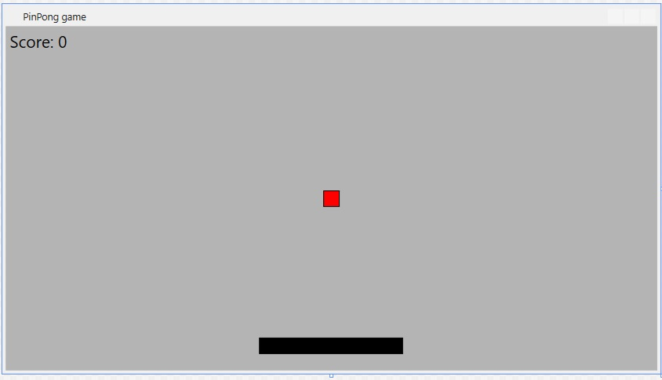

# PingPong Game

1st TW week exercise in .NET basics module

## Description

A team project derived from the classic game of Pong written in C# using Windows Presentation Foundation.

## The vision

## Feature set

* Application is started and stopped normally
* Pressing ESC stops the the application
* With space it is paused
* Each touching with ball is scored
* Score is shown after I am done/stopped
* Score is visible contionusly
* Levels are defined (harder)
* Level is visibled
* Progress is shown in the level (procent)